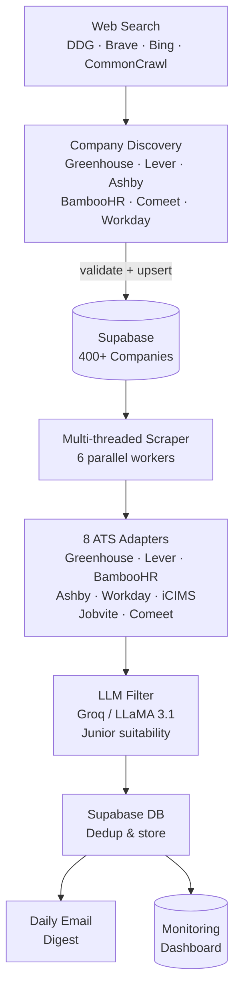

# Open Jobs — Automated Job Aggregation for Junior Developers

[](https://www.python.org/)
[](https://open-jobs-dashboard.onrender.com)
[](https://github.com/NivDotan/Open-Jobs-Web-Backend/actions/workflows/ci.yml)
[](LICENSE)

Automated job aggregation platform that scrapes **400+ Israeli tech companies** daily and emails curated junior-developer opportunities — filtered by an LLM — so students don't have to check each company's careers page manually.

**Live dashboard:** [open-jobs-dashboard.onrender.com](https://open-jobs-web-backend.onrender.com/)

---

## How It Works



---

## Key Metrics

| Metric | Value |
|---|---|
| Companies scraped | 400+ |
| ATS platforms supported | 8 |
| Scrape interval | Every 2 hours (08:00–22:30 UTC) |
| LLM model | Groq LLaMA 3.1 8B Instant |
| Database | Supabase (PostgreSQL) |
| Hosting | Render (cron job + web service) |

---

## Tech Stack

| Layer | Technology |
|---|---|
| Language | Python 3.11 |
| Web framework | Flask 3.0 |
| Database | Supabase (PostgreSQL) |
| LLM | Groq API (LLaMA 3.1 8B) |
| Scraping | requests, BeautifulSoup, Selenium |
| Data | pandas, numpy |
| Frontend | Vanilla JS, Chart.js |
| Auth | Supabase Auth (Google OAuth) |
| Hosting | Render |
| CI | GitHub Actions |

---

## Features

- **Multi-threaded scraping** — `ThreadPoolExecutor` with 6 workers across all 400+ companies
- **8 ATS adapters** — unified interface over Greenhouse, Lever, BambooHR, Ashby, Workday, iCIMS, Jobvite, and Comeet APIs
- **LLM classification** — Groq/LLaMA determines junior suitability; falls back to keyword matching if the API is unavailable
- **Deduplication** — per-day dedup prevents the same job appearing in multiple emails
- **Failure tracking** — per-company consecutive failure counter; auto-deactivates after 10 failures
- **Alerting** — email alerts for high error rates, no-jobs scenarios, and company failures (2-hour cooldown)
- **Monitoring dashboard** — real-time KPIs, 7-day trends, ATS breakdown, email history, admin panel

---

## Architecture

```
Scrapers/
├── CleanScript.py          # Orchestrator — schedules and dispatches scraping
├── job_scrapers.py         # 8 ATS-specific API adapters
├── telegramInsertBot.py    # Israel location filter, dedup, email dispatch
├── schedule_manager.py     # Schedule checking and execution flow
├── local_llm_function.py   # Groq API wrapper with fallback
├── db_operations.py        # Supabase read/write layer
├── alerting.py             # Email alerts with cooldown logic
├── log_cleanup.py          # Log rotation (compress 7d, delete 30d)
├── company_discovery.py    # Discovery orchestrator + CLI
├── discovery_search.py     # Search engine layer (DDG → Brave → Bing → CC)
└── discovery_ats.py        # Per-ATS discover & validate functions

DashboardApp/
├── app.py                  # Flask app — init, auth, all route handlers
├── data_sources.py         # DB queries + filesystem fallback parsers
├── analytics.py            # Job title / requirement trend analytics
└── supabase_client.py      # Supabase connection and email history queries
```

---

## Quick Start

```bash
# 1. Clone and install
git clone https://github.com/NivDotan/Open-Jobs-Web-Backend.git
cd Open-Jobs-Web-Backend/Scrapers
pip install -r requirements.txt

# 2. Configure environment
cp .env.example .env
# Fill in SUPABASE_URL, SUPABASE_KEY, GROQ_API_KEY, EMAIL_*, etc.

# 3. Run once (cron mode)
RUN_MODE=cron python CleanScript.py

# 4. Run with local dashboard (port 5050)
RUN_MODE=local python CleanScript.py
```

---

## Company Discovery

The discovery system automatically finds new Israeli companies on supported ATS platforms, validates them against the live ATS APIs, adds them to the database, and emails you a report.

### How it works

```
DDG Search (site:boards.greenhouse.io "Israel" ...)
  ↓ fallback: Brave → Bing → local cache → Common Crawl
Extract slugs from URLs
  ↓
Validate each slug via the ATS API (must return live jobs)
  ↓
Cross-reference DB → tag as NEW or already in DB
  ↓
Upsert new companies → Supabase → picked up on next scraper run
  ↓
Email report to RECIPIENT_EMAILS
```

**Supported ATS platforms for discovery:** Greenhouse · Lever · Ashby · BambooHR · Comeet · Workday

### Manual usage

```bash
cd Scrapers

# Discover all ATS platforms (writes to DB + sends email)
python company_discovery.py

# Preview only — no DB changes
python company_discovery.py --dry-run

# One ATS at a time
python company_discovery.py --ats workday --dry-run

# Debug: print every search URL found
python company_discovery.py --ats green --dry-run --debug

# Validate known companies from DB/local files (useful when search is rate-limited)
python company_discovery.py --validate-known --dry-run
```

### Cron job setup

Discovery should run **once per day** — new companies don't appear every 2 hours, and the search backends rate-limit aggressive polling. Running it daily alongside the main scraper is enough.

#### On Render (recommended)

Add a second **Cron Job** service in Render alongside the existing scraper job:

| Setting | Value |
|---|---|
| Build command | `pip install -r Scrapers/requirements.txt` |
| Start command | `cd Scrapers && python company_discovery.py` |
| Schedule | `0 6 * * *` (daily at 06:00 UTC) |
| Environment | Same env vars as the main scraper service |

#### On Linux/macOS (crontab)

```bash
# Run discovery once daily at 06:00
0 6 * * * cd /path/to/Open-Jobs-Web-Backend/Scrapers && python company_discovery.py >> logs/discovery.log 2>&1
```

#### On Windows (Task Scheduler)

```
Program:  python
Arguments: C:\path\to\Open-Jobs-Web-Backend\Scrapers\company_discovery.py
Start in: C:\path\to\Open-Jobs-Web-Backend\Scrapers
Trigger:  Daily at 06:00
```

---

## Running Tests

```bash
cd Scrapers
pytest tests/ -v
```

---

## Environment Variables

| Variable | Description |
|---|---|
| `SUPABASE_URL` | Supabase project URL |
| `SUPABASE_KEY` | Supabase anon/service key |
| `GROQ_API_KEY` | Groq API key for LLM classification |
| `EMAIL_SENDER` | Gmail address for sending emails |
| `EMAIL_PASSWORD` | Gmail app password |
| `EMAIL_RECIPIENTS` | Comma-separated recipient list |
| `RUN_MODE` | `local` (with dashboard) or `cron` (single run) |
| `ADMIN_EMAIL` | Email granted dashboard admin access |

See [SYSTEM_DOCUMENTATION.md](SYSTEM_DOCUMENTATION.md) for the full environment variable reference and deployment guide.

---

## License

MIT © [Niv Dotan](https://github.com/NivDotan)
