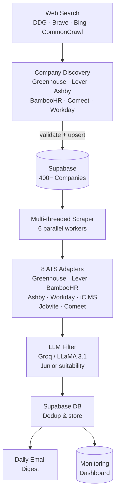

# Open Jobs — Automated Job Aggregation for Junior Developers

[](https://www.python.org/)
[](https://open-jobs-dashboard.onrender.com)
[](https://github.com/NivDotan/Open-Jobs-Web-Backend/actions/workflows/ci.yml)
[](LICENSE)

Automated job aggregation platform that scrapes **400+ Israeli tech companies** daily and emails curated junior-developer opportunities — filtered by an LLM — so students don't have to check each company's careers page manually.

**Live dashboard:** [open-jobs-dashboard.onrender.com](https://open-jobs-web-backend.onrender.com/)

---

## How It Works



---

## Key Metrics

| Metric | Value |
|---|---|
| Companies scraped | 400+ |
| ATS platforms supported | 8 |
| Scrape interval | Every 2 hours (08:00–22:30 UTC) |
| LLM model | Groq LLaMA 3.1 8B Instant |
| Database | Supabase (PostgreSQL) |
| Hosting | Render (cron job + web service) |

---

## Tech Stack

| Layer | Technology |
|---|---|
| Language | Python 3.11 |
| Web framework | Flask 3.0 |
| Database | Supabase (PostgreSQL) |
| LLM | Groq API (LLaMA 3.1 8B) |
| Scraping | requests, BeautifulSoup, Selenium |
| Data | pandas, numpy |
| Frontend | Vanilla JS, Chart.js |
| Auth | Supabase Auth (Google OAuth) |
| Hosting | Render |
| CI | GitHub Actions |

---

## Features

- **Multi-threaded scraping** — `ThreadPoolExecutor` with 6 workers across all 400+ companies
- **8 ATS adapters** — unified interface over Greenhouse, Lever, BambooHR, Ashby, Workday, iCIMS, Jobvite, and Comeet APIs
- **LLM classification** — Groq/LLaMA determines junior suitability; falls back to keyword matching if the API is unavailable
- **Deduplication** — per-day dedup prevents the same job appearing in multiple emails
- **Failure tracking** — per-company consecutive failure counter; auto-deactivates after 10 failures
- **Alerting** — email alerts for high error rates, no-jobs scenarios, and company failures (2-hour cooldown)
- **Monitoring dashboard** — real-time KPIs, 7-day trends, ATS breakdown, email history, admin panel

---

## Architecture

```
Scrapers/
├── CleanScript.py          # Orchestrator — schedules and dispatches scraping
├── job_scrapers.py         # 8 ATS-specific API adapters
├── telegramInsertBot.py    # Israel location filter, dedup, email dispatch
├── schedule_manager.py     # Schedule checking and execution flow
├── local_llm_function.py   # Groq API wrapper with fallback
├── db_operations.py        # Supabase read/write layer
├── alerting.py             # Email alerts with cooldown logic
├── log_cleanup.py          # Log rotation (compress 7d, delete 30d)
├── company_discovery.py    # Discovery orchestrator + CLI
├── discovery_search.py     # Search engine layer (DDG → Brave → Bing → CC)
└── discovery_ats.py        # Per-ATS discover & validate functions

DashboardApp/
├── app.py                  # Flask app — init, auth, all route handlers
├── data_sources.py         # DB queries + filesystem fallback parsers
├── analytics.py            # Job title / requirement trend analytics
└── supabase_client.py      # Supabase connection and email history queries
```

---

## Portfolio Analytics Dashboard

The AI Insights page is now a portfolio-style DS/DA dashboard backed by `GET /api/analytics/portfolio`.

### What it analyzes

- Live scraped jobs from `scrapers_data`
- LLM-enriched descriptions and requirements from `desc_reqs_scrapers`
- Email delivery history from `emailed_jobs_history`
- Company health from `company_data`
- Latest run metadata from `scraper_log_runs`
- `us_jobs_history` remains optional where available

### Read-time standardization

The dashboard does not backfill or mutate Supabase rows. It standardizes messy data at read time in `DashboardApp/standardization.py` before analytics run:

- Company names: trims artifacts and produces stable display/normalized names
- Titles: normalizes separators, seniority terms, title family, and job type
- Locations: normalizes city/country/workplace signals
- Links: canonicalizes URLs and removes tracking fragments
- ATS names: normalizes source labels such as Greenhouse, Lever, Comeet, Workday
- Junior labels: normalizes booleans, text labels, unclear values, and missing values
- Requirements: parses JSON-list strings, Python lists, newline text, and semicolon text
- Descriptions: strips HTML/entities, collapses whitespace, and creates clean previews
- Skills: extracts technical-only taxonomy and excludes soft skills from public skill charts
- Timestamps/statuses: normalizes dates and run statuses for stable analytics

### Visible analysis

The AI Insights page now focuses on:

- Analysis filters that update automatically without an Apply button
- Loading feedback while new filter data is fetched: sticky banner, moving progress track, and card skeleton shimmer
- Technical Demand chart for hard skills only
- Requirement Blueprint showing what listings usually request and how often
- Seniority Requirement Matrix showing how requirements change by Entry, Mid, Senior, and Unspecified levels
- Senior-Level Lift showing requirements more common in senior listings than entry listings
- Programming languages, cloud/infrastructure, data/analytics tools, AI/ML signals, job type breakdown, experience/education, top companies, and company health

Removed from the visible AI Insights page: generic KPI strip, Daily Trend, Country Breakdown, Data Quality card, Methodology text, and Standardized Job Samples table.

### API

`GET /api/analytics/portfolio`

Query params:

| Param | Description |
|---|---|
| `start` | Start date, `YYYY-MM-DD` |
| `end` | End date, `YYYY-MM-DD` |
| `companies` | Comma-separated company filter |
| `keyword` | Search term over company, title, location, description, and requirements |
| `country` | Country filter |
| `seniority` | Seniority filter |
| `limit` | Matching-job payload limit, capped by the API |

Response includes `summary`, `funnel`, `skills`, `skill_taxonomy`, `listing_analysis`, `job_types`, `experience_levels`, `education`, `locations`, `companies`, `quality`, `matching_jobs`, and `methodology`.

---

## Groq Batch Queue in Supabase Storage

When the live Groq call is rejected because the free-plan quota or rate limit was hit, the scraper now queues that job as a Groq Batch-compatible JSONL request in Supabase Storage. Successful Groq calls still write to `desc_reqs_scrapers`, and non-rate-limit failures keep the existing email fallback without being queued.

Implemented files:

- `Scrapers/groq_batch_queue.py` builds/deduplicates JSONL requests and uploads them to Supabase Storage
- `Scrapers/local_llm_function.py` exposes `build_junior_classification_prompt(raw_text)` so live calls and batch requests use the same prompt
- `Scrapers/telegramInsertBot.py` queues only Comeet, Greenhouse, and Workday jobs where clean text was extracted and Groq hit a quota/rate-limit error
- `Scrapers/tests/test_groq_batch_queue.py` covers JSONL shape, prompt/model matching, rate-limit detection, dedupe, metadata sidecar, and smoke paths

Storage details:

| Item | Value |
|---|---|
| Bucket | `groq-batch-requests` |
| Recommended visibility | Private |
| Daily request object | `YYYY-MM-DD/groq_batch_YYYY-MM-DD.jsonl` |
| Daily metadata object | `YYYY-MM-DD/groq_batch_YYYY-MM-DD.meta.jsonl` |
| Smoke request object | `smoke/groq_batch_storage_smoke_YYYY-MM-DD.jsonl` |
| Smoke metadata object | `smoke/groq_batch_storage_smoke_YYYY-MM-DD.meta.jsonl` |

Supabase Storage does not have a true append API, so the queue downloads the existing object, skips any existing `custom_id`, appends missing JSONL lines, and re-uploads with upsert enabled. `custom_id` is `job:<sha256(company|job_name|link)>`.

The queued request body matches the current sync Groq call: model from `LLM_MODEL` (default `llama-3.1-8b-instant`), `POST /v1/chat/completions`, one user message with the same classification prompt, `temperature: 1`, `max_completion_tokens: 1024`, `top_p: 1`, `stream: false`, and `response_format: {"type": "json_object"}`.

Manual storage smoke test:

```bash
python Scrapers/groq_batch_queue.py --smoke
```

The smoke test writes only under `smoke/`, not to the real rejected-jobs daily batch file. It requires backend Supabase Storage write permission. Use `SUPABASE_SERVICE_ROLE_KEY` or `supabaseServiceKey` on the server side; a public bucket alone is not enough and is not recommended for production.

### Dashboard design — "Egg" theme

The dashboard UI uses a warm, light, editorial theme called **Egg** (inspired by
[jobs.scalefox.ai](https://jobs.scalefox.ai)) — off-white paper background, white cards
with hairline borders, a single teal signal accent (`#0d9488`), and an
Inter / Raleway / Instrument Serif type system. It replaced the older dark "Obsidian Gold"
theme.

The stylesheet (`DashboardApp/static/css/styles.css`) is token-driven, so the whole look
is controlled by the `:root` CSS variables. Full details — palette, fonts, what changed,
and how to retune it — are in **[`DashboardApp/DESIGN.md`](DashboardApp/DESIGN.md)**.

> When editing `styles.css` or `dashboard.js`, bump the `?v=` cache-bust version on the
> `<link>`/`<script>` tags in `DashboardApp/templates/index.html`.

---

## Quick Start

```bash
# 1. Clone and install
git clone https://github.com/NivDotan/Open-Jobs-Web-Backend.git
cd Open-Jobs-Web-Backend/Scrapers
pip install -r requirements.txt

# 2. Configure environment
cp .env.example .env
# Fill in supabaseUrl/supabaseKey, LLM_API_KEY, EMAIL_*, etc.
# Add SUPABASE_SERVICE_ROLE_KEY on backend/server env if using the Groq batch Storage queue.

# 3. Run once (cron mode)
RUN_MODE=cron python CleanScript.py

# 4. Run with local dashboard (port 5050)
RUN_MODE=local python CleanScript.py
```

---

## Company Discovery

The discovery system automatically finds new Israeli companies on supported ATS platforms, validates them against the live ATS APIs, adds them to the database, and emails you a report.

### How it works

```
DDG Search (site:boards.greenhouse.io "Israel" ...)
  ↓ fallback: Brave → Bing → local cache → Common Crawl
Extract slugs from URLs
  ↓
Validate each slug via the ATS API (must return live jobs)
  ↓
Cross-reference DB → tag as NEW or already in DB
  ↓
Upsert new companies → Supabase → picked up on next scraper run
  ↓
Email report to RECIPIENT_EMAILS
```

**Supported ATS platforms for discovery:** Greenhouse · Lever · Ashby · BambooHR · Comeet · Workday

### Manual usage

```bash
cd Scrapers

# Discover all ATS platforms (writes to DB + sends email)
python company_discovery.py

# Preview only — no DB changes
python company_discovery.py --dry-run

# One ATS at a time
python company_discovery.py --ats workday --dry-run

# Debug: print every search URL found
python company_discovery.py --ats green --dry-run --debug

# Validate known companies from DB/local files (useful when search is rate-limited)
python company_discovery.py --validate-known --dry-run
```

### Cron job setup

Discovery should run **once per day** — new companies don't appear every 2 hours, and the search backends rate-limit aggressive polling. Running it daily alongside the main scraper is enough.

#### On Render (recommended)

Add a second **Cron Job** service in Render alongside the existing scraper job:

| Setting | Value |
|---|---|
| Build command | `pip install -r Scrapers/requirements.txt` |
| Start command | `cd Scrapers && python company_discovery.py` |
| Schedule | `0 6 * * *` (daily at 06:00 UTC) |
| Environment | Same env vars as the main scraper service |

#### On Linux/macOS (crontab)

```bash
# Run discovery once daily at 06:00
0 6 * * * cd /path/to/Open-Jobs-Web-Backend/Scrapers && python company_discovery.py >> logs/discovery.log 2>&1
```

#### On Windows (Task Scheduler)

```
Program:  python
Arguments: C:\path\to\Open-Jobs-Web-Backend\Scrapers\company_discovery.py
Start in: C:\path\to\Open-Jobs-Web-Backend\Scrapers
Trigger:  Daily at 06:00
```

---

## Running Tests

```bash
cd Scrapers
pytest tests/ -v
```

Dashboard analytics tests:

```bash
python -m pytest DashboardApp/tests -v
```

Recent verification for the portfolio analytics work:

```bash
python -m py_compile DashboardApp/standardization.py DashboardApp/analytics.py DashboardApp/app.py
node --check DashboardApp/static/js/dashboard.js
python -m pytest DashboardApp/tests -v
python -m pytest Scrapers/tests -v
```

Groq batch queue verification:

```bash
python -m py_compile Scrapers/local_llm_function.py Scrapers/telegramInsertBot.py Scrapers/groq_batch_queue.py
python -m pytest Scrapers/tests -v
python Scrapers/groq_batch_queue.py --smoke
```

---

## Environment Variables

| Variable | Description |
|---|---|
| `SUPABASE_URL` | Supabase project URL |
| `SUPABASE_KEY` | Supabase anon/service key |
| `supabaseUrl` | Supabase project URL used by scraper modules |
| `supabaseKey` | Supabase key used by existing scraper modules |
| `SUPABASE_SERVICE_ROLE_KEY` | Server-only Supabase service-role key for Storage writes and bucket creation |
| `supabaseServiceKey` | Optional alternate server-only service-role env name |
| `GROQ_API_KEY` | Groq API key for LLM classification |
| `LLM_API_KEY` | Groq key read by `Scrapers/local_llm_function.py` |
| `LLM_MODEL` | Groq model for live and batch classification, default `llama-3.1-8b-instant` |
| `GROQ_BATCH_BUCKET` | Optional Storage bucket override, default `groq-batch-requests` |
| `GROQ_BATCH_QUEUE_DIR` | Optional prefix before daily batch folders |
| `EMAIL_SENDER` | Gmail address for sending emails |
| `EMAIL_PASSWORD` | Gmail app password |
| `EMAIL_RECIPIENTS` | Comma-separated recipient list |
| `RUN_MODE` | `local` (with dashboard) or `cron` (single run) |
| `ADMIN_EMAIL` | Email granted dashboard admin access |

See [SYSTEM_DOCUMENTATION.md](SYSTEM_DOCUMENTATION.md) for the full environment variable reference and deployment guide.

---

## License

MIT © [Niv Dotan](https://github.com/NivDotan)
